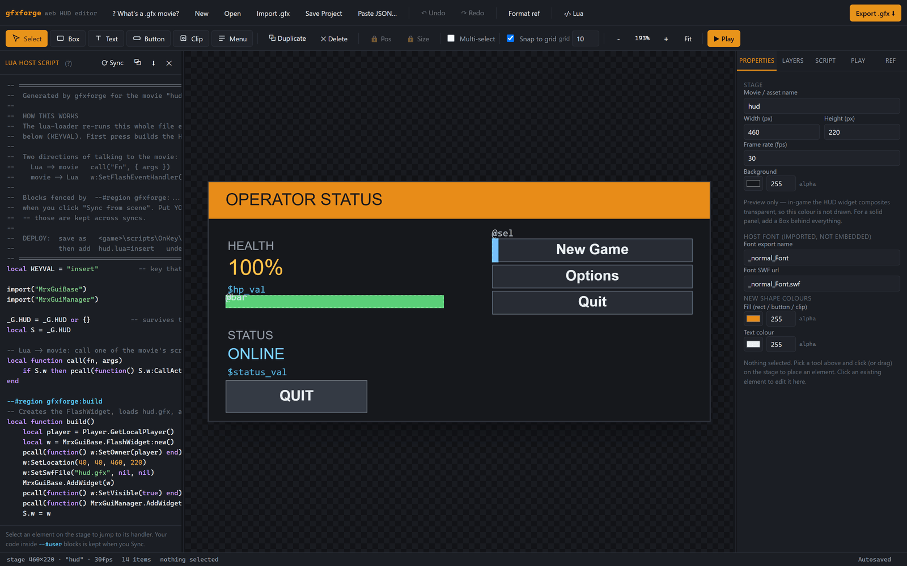

# gfxforge-web

A browser-based visual editor for authoring Scaleform GFx 2.x (`.gfx`) HUD
movies for Mercenaries 2 (PC) — no Adobe tools, no Python, no install. This is
a from-scratch JS port + significant extension of the original
[gfxforge](https://github.com/loganw234/mercs2-tools-gfxforge) Python library
and its tkinter editor.

Open `index.html` in a browser and go. Everything runs client-side: no
server, no build step required to *use* it (only to modify it — see below).



## What it does

- Place and edit rectangles, text fields, buttons, movie clips, and images on
  a canvas, with drag/resize, snapping, undo/redo, multi-select,
  align/distribute, and touch support.
- Solid or gradient fills (linear/radial), strokes, and rounded corners.
- **Named timeline frames**, so a HUD can model UI state the way the game's own
  menus do: assign items to frames, label them, and drive them from script with
  `gotoAndStop("alert")`. Content that leaves a frame is removed and re-placed
  at a stable depth automatically.
- **Clip event handlers** — `onRelease`, `onRollOver`, `onEnterFrame` and the
  rest, attached to a placed movieclip. This is how the shipped game movies
  build interactive UI; see [What the game actually uses](#what-the-game-actually-uses).
- **Exported symbols** (`ExportAssets`), so script can `attachMovie()` a clip at
  runtime, and **instance names** on rects and text fields so script can reach
  the object itself (`_root.hp_txt.textWidth`) rather than only a bound variable.
- Rich text fields: multiline, word wrap, HTML, alignment, borders, max length.
  9-slice (`DefineScale9Grid`) guides and per-item opacity on placement.
- Write behaviour in an AS2-subset language compiled to real AVM1 bytecode —
  `if`/`else`, `while`, `do`/`while`, `for`, `for`-in, `switch`, functions and
  function expressions, `new`, object and array literals, ternary, `typeof`,
  `delete`, `instanceof`, bitwise operators, `++`/`--`, strict equality,
  short-circuiting `&&`/`||`, compound assignment, `trace()`, and the timeline
  verbs. See [Scripting language](#scripting-language) for the full list and the
  one deliberate omission.
- **Play mode**: an actual AVM1 interpreter runs your script in-browser, so
  you can click buttons and manually call script functions to watch the
  stage update *before* ever loading it in the game.
- Export a ready-to-inject `.gfx` file, or save/load a JSON project file that
  a human (or an LLM) can hand-author directly.
- Autosave to `localStorage`, undo/redo, and a reference-image underlay for
  tracing against a real game screenshot.

## What the game actually uses

The feature set above isn't guesswork about what Scaleform can do in the
abstract — it's aimed at what *Mercenaries 2* actually ships. Tag and opcode
frequencies below come from scanning 42 of the game's own `.gfx` movies:

| Feature | Appears in the shipped movies |
| --- | --- |
| Multiple frames (`ShowFrame`) | 32,493 across 41 of 42 files |
| `ExportAssets` → `attachMovie` | 1,516 entries across 23 files |
| `FrameLabel` + `gotoAndStop`/`Play` | 1,080 labels, 986 gotos, 22 files |
| `RemoveObject2` | 809 across 25 files |
| `DefineExternalImage` (tag 1001) | 773 across 25 files |
| `strictEquals`, real `var` locals, `DefineFunction2` | ~7,500 opcodes |
| `DefineButton` / `DefineButton2` | **4 uses, in 1 file** |
| `DefineBitsLossless2` (embedded bitmaps) | **0 uses** |

Two things worth knowing from that:

- **The game does not use SWF buttons.** It builds interactive UI from
  movieclips carrying clip event handlers. The `button` item kind still works
  and still emits a real `DefineButton`, but `clip` + `events` is the idiom that
  matches the game.
- **The game does not embed bitmaps.** Every image is an external texture
  referenced by `DefineExternalImage`, which lives in a separate WAD asset. The
  `image` item's embedded `DefineBitsLossless2` path is still the only one
  implemented here, and is still the least verified part of the codec — see the
  confidence notes.

## Scripting language

Supported: numbers (decimal and `0xHEX`), strings, booleans, `null`,
`undefined`, array and object literals; variables, `this`, `obj.member`,
`obj[key]`, calls and method calls, `new C(a)`, function expressions, ternary;
`+ - * / %`, comparisons including `===`/`!==`, short-circuiting `&&`/`||`,
`! - + ~`, `typeof`, `delete`, `instanceof`, bitwise `& | ^ << >> >>>`, `++`/`--`
in both fixities, and compound assignment (`+= -= *= /= %= &= |= ^= <<= >>= >>>=`);
`if`/`else`, `while`, `do`/`while`, `for(;;)`, `for`-in, `switch`/`case`/`default`,
`break`, `continue`, `var`, `function`, `return`, and `fscommand("evt", x)`.
`trace()`, `random(n)`, `getTimer()`, `play()`, `stop()`, `gotoAndStop(f)` and
`gotoAndPlay(f)` lower to single opcodes.

**`try`/`catch`/`throw` is deliberately not supported.** GFx 2.1.57 routes
opcode `0x8F` (try) to its "Unsupported opcode" branch, so a movie using it
would load and then silently skip the handler. Failing at compile time is the
better outcome, so the compiler rejects it rather than emitting it.

Known limits: calls are by name or method (you can't call an arbitrary
expression result without going through a variable); `break` inside `switch` or
`for`-in leaves its discriminant on the AVM1 stack, which is harmless because
that stack is per-action-buffer and discarded at its end, but it isn't a tidy
unwind; codegen errors (e.g. "break outside of a loop") don't carry line
numbers, only tokenizer/parser errors do.

## Proving it in-engine

Everything above is only worth what's been checked against the actual game. The
`examples/mercs2/` directory holds paired generator + Lua host scripts that were
run live, each with its findings written up next to it.

**`ess_probe.js` / `.lua`** — the capability probe. Confirms in the running game
that GFx 2.1.57 supports runtime object creation and drawing:
`createEmptyMovieClip`, `createTextField` + `TextFormat` resolving the movie's
**imported** font, the vector API including `curveTo`, `attachMovie` against an
`ExportAssets` symbol, `getNextHighestDepth`, `removeMovieClip`, and the
movie→Lua `fscommand` channel. Results and the exact readings are in
[`ess_probe.results.md`](examples/mercs2/ess_probe.results.md).

**`ess_ui.js`** — the real workout. Generates `ess_ui.gfx`, a movie whose payload
is an entire AS2 UI runtime (~48 functions): a theme table, rounded/gradient
chrome drawn with `curveTo`, runtime text fields, pooled unbounded rows,
panel/list/bar/board widgets, `setMask`, scrollbars, easing, and a global scale.
It replaced eight hand-authored template movies in the
[Essentials framework](https://github.com/loganw234/mercs2-lua-essentials)'s UI
kit, and it is the strongest evidence that the compiler and codec produce
bytecode this player actually accepts — a movie this size exercises far more of
the opcode set than any unit test. Findings in
[`ess_ui.results.md`](examples/mercs2/ess_ui.results.md).

The remaining `ess_ui_*.lua` files are the staged verification drivers used to
check each layer against the live game.

A few things these turned up that are worth knowing if you're generating movies
for this engine:

- **`beginGradientFill`'s matrix argument is mandatory.** GFx checks `NArgs > 4`
  before touching the gradient, so a four-argument call silently draws a flat
  fill. Even with the matrix present, gradients render flat in this build at
  every rotation tested — treat them as unavailable.
- **The stage background colour is never drawn in-game.** HUD widgets composite
  transparent, so `SetBackgroundColor` is preview-only. Draw your own panel fill.
- **`try`/`catch` is unavailable** — see [Scripting language](#scripting-language).
- **A `FlashWidget` only covers the rect you give it, and its movie only draws
  its own stage.** MrxGui's widget space is 480 tall and `480 × aspect` wide (853
  on 16:9), so a 640×480 stage in a 640×480 rect occupies the left ~75% of a
  widescreen display.

## Running it

Just open `index.html`. That's the whole install process.

If you want a single self-contained HTML file instead (e.g. to email
someone, or paste into a tool that wants one file), see **Building the
bundle** below — `dist/gfxforge-editor.bundled.html` is a pre-built one,
already up to date as of this commit.

## File layout

```
index.html              the app shell — loads everything below in order
css/style.css            all styling
js/codec/                pure format/logic, no DOM access at all
  bitio.js                bit-level primitives: RECT, MATRIX, twips
  swf.js                  SWF/GFX tag encoders (shapes, text, buttons, sprites,
                          frame labels, clip actions, colour transforms...)
  avm1.js                 AVM1 bytecode assembler (the full opcode set GFx
                          2.1.57 implements)
  compiler.js              AS2-subset -> AVM1 compiler (lexer/parser/codegen)
  movie.js                the Movie authoring API (.rect(), .button(), frames,
                          .exportAs(), .build()...)
  verify.js                structural validator for a built .gfx
  avm1-interpreter.js      executes compiled bytecode, for Play mode
  bitmap.js                image -> DefineBitsLossless2 (incl. a hand-rolled
                           zlib "stored block" encoder — see confidence notes)
js/editor/                DOM/canvas/UI logic
  project-io.js            state defaults, project JSON <-> editor state
  render.js                canvas drawing, state object, history (undo/redo)
  interaction.js            mouse/keyboard, selection, drag/resize/marquee
  touch.js                  touch equivalents (drag, pinch-zoom, double-tap)
  panels.js                 the Properties tab: all the field/fill/stroke editors
  layers-script.js          Layers tab, Script tab, movie-building
  play.js                   Play mode: button clicks, call-function panel, log
  reference-image.js        the tracing-reference underlay
  wiring.js                 toolbar/menu wiring, save/open/export, modals
  autosave.js               localStorage persistence
  init.js                   sample project, format-reference help text, boot
tests/                    Node-based test suite (see Testing below)
examples/mercs2/          paired generator + Lua host scripts, run against the
                          real game (see Proving it in-engine below)
dist/                     pre-built single-file bundle (regenerate with build.sh)
build.sh / build.py       bundler: splices css/js into one HTML file
```

Load order in `index.html` matters (each module is a plain `<script>`, not an
ES module, deliberately — so it still works when opened via `file://` without
hitting CORS restrictions on `import`). Codec files load before editor files;
within each, dependencies load before their dependents. A few places
reference a later-loading module from *inside* a function body rather than a
top-level alias — that's always safe (function bodies only run after
everything's loaded), and it's commented at each spot where it's load-order
sensitive rather than just style.

## Building the bundle

```
./build.sh
```

Regenerates `dist/gfxforge-editor.bundled.html` from the current
`index.html` + `css/` + `js/`. Requires `python3` at build time only — the
output itself has zero dependencies, same as the split version. Run this
after editing anything under `css/` or `js/` if you want the bundle to stay
current.

## Testing

```
node tests/run.js
```

Runs the whole suite (190+ assertions across ~20 files) in a couple of
seconds — no browser, no dependencies beyond Node itself. It loads the real
source files (not the bundle) into a sandboxed `vm` context with a minimal
DOM stub, so it can exercise real application code without a browser. It
cannot exercise actual canvas pixels or real mouse/touch event dispatch —
what it verifies is everything DOM-independent: codec byte output, the
compiler, the AVM1 interpreter, project load/save, multi-select math,
autosave, and so on. Add new tests as `tests/suite.*.js`; each is picked up
automatically.

Two specific tests shell out to a real `python3` to cross-check output
against ground truth that isn't just "this code agrees with itself" — the
zlib compression (`suite.bitmap.js`) is verified against Python's actual
`zlib.decompress`. If `python3` isn't on your PATH those specific assertions
are skipped (logged, not silently ignored) rather than failing.

Two more suites test against things this codebase didn't produce, for the same
reason:

- **`suite.avm1-encoding.js`** asserts against byte sequences lifted out of
  shipped Mercenaries 2 movies, not against our own round trip. That distinction
  is the whole point — see the `ActionPush` note in the confidence section below.
- **`suite.uikit-regression.js`** rebuilds the movies of an external UI kit from
  their `.gfx` project sources and diffs against the `.gfx` files that shipped
  with it, so a change that alters existing output shows up as a byte diff. The
  kit lives outside this repo; when it isn't present those assertions skip and
  say so, like the `python3` ones.

## Confidence notes — what's actually verified, and how

Being specific about this matters more here than in most projects, because
the whole point is generating a binary format for a game to load — a subtly
wrong byte is a silent bug, not a crash.

**Verified against the Scaleform GFx 2.1.57 SDK source.** The newer work
(timeline tags, clip actions, colour transforms, the extended opcode set, edit
text flags) was written against the actual player source rather than the general
SWF spec — the tag loader dispatch table in `GFxTagLoaders.cpp`, the action
dispatch switch in `GFxAction.cpp`, `GFxStream::ReadCxformRgba`, and
`GFxPlayerImpl.cpp`'s `PO2_HasActions` branch. That's what establishes, for
example, that `try` is unimplemented in this player, that `DefineLocal` falls
back to `SetVariable` outside a function so one encoding is correct in both
contexts, and that clip-event wire flags are literally GFx's own `Event_*`
constants. Where the SDK left a choice open, the shipped game movies settled it.

**Solid, byte-for-byte verified against the original Python library:**
`bitio.js`, `swf.js`'s original tag encoders, `avm1.js`, the original
compiler feature set, `movie.js`'s original rect/text/button/clip/menu path.
Every one of these was checked by generating the same output from both the
Python original and this port and diffing the hex byte-for-byte — not just
"looks right," but literally identical output. See git history / the
original port conversation for the methodology; the 54-case compiler
baseline in `tests/fixture.compiler-baseline.json` is a frozen snapshot of
that verification and is re-checked on every test run.

**Where that parity was deliberately broken.** 49 of those 54 cases are still
byte-identical. Five changed, each recorded with a `note` in the fixture:

- **`ActionPush` doubles were encoded wrong** — in this port *and* in the Python
  original. GFx reads the two 32-bit halves swapped, high word first
  (`GFxAction.cpp` case `0x96` type 6, whose own comment calls the layout
  "wacky format: 45670123"); both libraries wrote a plain little-endian
  `float64`, which the player decodes as a denormal around `5.3e-315`. So every
  non-integer literal in a script was silently garbage. Confirmed against 15,512
  type-6 pushes in the shipped movies: read word-swapped they decode to
  authoring values (`0.25`, `2.5`, `12.5`, `59.5`); `0.25` now encodes to
  `00 00 d0 3f 00 00 00 00`, byte-identical to what the game's own files
  contain. `tests/suite.avm1-encoding.js` pins this against those real bytes.
- **`&&` / `||` now short-circuit** and yield the operand value, as AS2 does.
  They previously compiled to the `And`/`Or` opcodes, which always evaluate both
  sides and coerce to a boolean — so `x && f()` called `f()` even when `x` was
  false.
- **`var` now emits `DefineLocal`.** It previously emitted `SetVariable`, which
  made every `var` inside a function a `_root` global.

This bug is worth dwelling on, because it's precisely the failure mode the rest
of these notes warn about: the encoder and the interpreter agreed with each
other, so the whole test suite passed while both disagreed with the actual
player. Agreement between two halves of one codebase is not verification. The
new encoding tests assert against bytes lifted out of real game movies for that
reason.

**New features, independently verified (no Python original to compare
against, since the original library didn't have these):**
- The scripting extensions (`for`/`break`/`continue`, compound assignment,
  arrays) and the AVM1 interpreter are verified by direct behavioural
  assertion — there's no reference AVM1 player available, so correctness
  rests on careful reading of the AVM1 bytecode spec plus extensive test
  coverage (`tests/suite.interpreter.js`, `tests/suite.scripting-features.js`).
- The newer language features and the timeline/clip-action encoders are covered
  the same way, plus one structural check that isn't self-referential: every new
  construct's bytecode is walked by `verify.js`'s reader, which was written from
  the record format rather than by inverting the assembler
  (`tests/suite.as2-features.js`, `tests/suite.timeline.js`,
  `tests/suite.project-timeline.js`).

**Confirmed in the running game.** The `examples/mercs2/` work (see [Proving it
in-engine](#proving-it-in-engine)) loaded generated movies into Mercenaries 2 and
drove them from Lua. That covers the compiler across a large real program — the
`ess_ui.gfx` runtime is ~48 AS2 functions using objects, `new`, function
expressions, `switch`, `for`-in, `++`/`--`, strict equality and short-circuit
logic — plus `fscommand`, `ExportAssets`/`attachMovie`, and instance names. So
the extended compiler and much of the tag work are no longer just
"spec-plausible".

Still **not** in-engine verified, and worth checking yourself before relying on
them: multi-frame timelines and frame labels, clip event handlers, 9-slice, and
colour transforms. They follow the SDK source and match patterns in the shipped
movies, but no generated movie has exercised them in the game yet. Gradients
*have* been tested and **do not work** — see the note above.
- Rounded corners, strokes, and gradients (`defineShapeEx` in `swf.js`) are
  verified by an *independent* decoder (`tests/shape-decoder.js`, written
  from the SWF spec rather than by inverting the encoder) that reconstructs
  the geometry and checks it's correct — closed paths, control points at the
  right corners, gradient matrices landing ratio=0/255 at the right edges,
  etc. This is real verification, not circular, but it's still one person's
  reading of the spec rather than a second independent implementation.

**Least verified — treat as experimental:** image import
(`bitmap.js`/`DefineBitsLossless2`). The zlib container is cross-checked
against Python's real `zlib` and is solid. What is *not* independently
verified is the exact bitmap pixel format GFx expects (byte order, whether
alpha is premultiplied) — there's no reference renderer available to confirm
colors/transparency come out right in practice. If you rely on this for real
assets, check a test image in-engine first. The in-app Format Reference
(Format ref button in the toolbar) repeats this same note.

## Project JSON format

Click **Format ref** in the app for the full schema with examples — it's
also reproduced in `js/editor/init.js` (`buildHelpBody`). Field names
deliberately mirror the original Python library's keyword arguments
(`fill`, `var`, `label_color`, snake_case throughout) so it reads the same as
gfxforge's own README and is easy for an LLM to generate directly: describe
the HUD you want, ask for JSON in this format, paste it in with "Paste
JSON…" in the app.


## License

[MIT](LICENSE) -- matching the rest of the Mercenaries 2 tooling.

## Disclaimer

This is an unofficial, non-commercial community fan project. It is **not affiliated with, associated with,
authorized by, endorsed by, or in any way officially connected to Electronic Arts or Pandemic Studios**.
*Mercenaries 2: World in Flames* and all related marks are the property of their respective owners.

This repository contains original code only -- no game assets are redistributed. It requires your own
legally-obtained copy of the game to be of any use.

If a rights holder objects to anything in this repository, contact me and I will comply with a removal
request.
